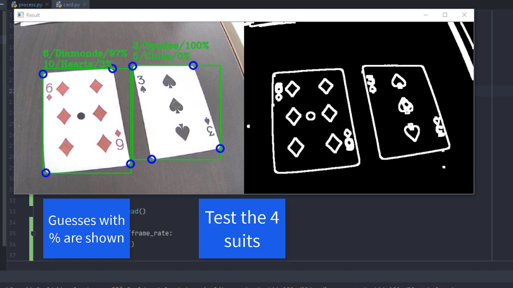

# Card_Recognizer

Card Recognizer is a program which can identify playing cards through the webcam. The user simply puts the card on a flat surface, and the program will threshold the image, find the card, isolate the corner, break it into rank and suit, and run both against a neural network to identify their value. It can identify as many cards as can fit on a frame, and different sets of decks can be used too. It processes the frame using the popular Python library OpenCV, and then uses a Tensorflow model to predict its suit and value.

Demonstration: [YouTube Video](https://www.youtube.com/watch?v=s2jYdsjWirs)

 

Tested using `Python 3.6`.

Relevant Packages:

- `opencv-python`: 4.3.0.36
- `numpy`: 1.19.1
- `tensorflow`: 2.2.0
- `sklearn`: 0.0
- `matplotlib`: 3.2.2
- `keras`: 2.3.1
- `scipy`: 1.5.0

```bash
python card.py
```
